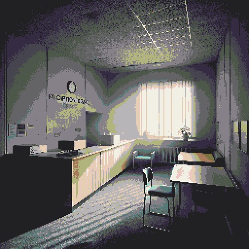

# Abandoned Library Explorer

A tiny, spooky point-and-click adventure game where you explore an abandoned library. Each dusty tome you discover opens a random real book from Google Books. But beware... you're not entirely alone in these halls.




## 🎮 Features

- Atmospheric exploration through a mysterious abandoned library
- Point-and-click navigation between rooms
- Interactive bookshelves that connect to real books via Google Books API
- Eerie background music
- One sneaky jumpscare (you've been warned! 👻)
- Retro-style Myst-inspired gameplay

## 🛠️ Prerequisites

- Python 3.7+
- Pygame
- PyWebView
- Requests
- NumPy

## 📦 Installation

1. Clone the repository:
```bash
git clone https://github.com/pdennis/abandonedlibrary
cd haunted-library
```

2. Install required packages:
```bash
pip install -r requirements.txt
```

3. Set up your Google Books API key:
   - Get an API key from [Google Cloud Console](https://console.cloud.google.com/)
   - Set it as an environment variable:
     ```bash
     export GOOGLE_BOOKS_API_KEY='your-api-key'
     ```
   - Or pass it directly to the GoogleBooksAPI class

4. Make sure you have the required asset folders:
   - `images/` - Contains all scene images
   - `audio/` - Contains background music and sound effects

## 🎯 How to Play

1. Run the game:
```bash
python library.py
```

2. Navigation:
   - Click the arrows to move between rooms
   - Explore bookshelves to discover random books from Google's vast library
   - Keep an eye out for interactive elements...

## 📁 Project Structure

- `game.py` - Main game file containing all game logic
- `images/` - Scene images and visual assets
- `audio/` - Sound effects and background music
  - `horror.mp3` - Background ambiance
  - `scream.mp3` - You'll find out...

## 🎨 Credits

- Built with Pygame and PyWebView
- Integrates with Google Books API
- Created as a fun Halloween project


